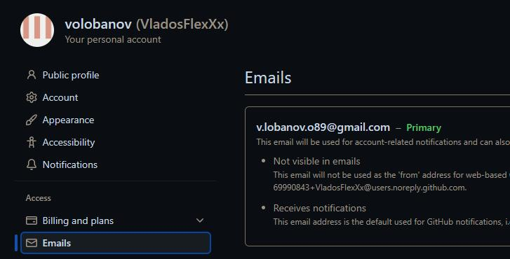
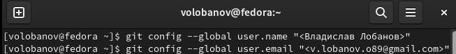
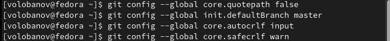
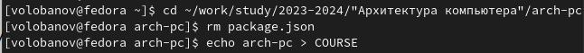
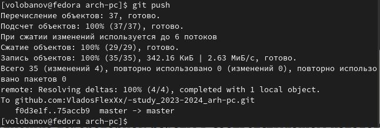

---
## Front matter
title: "Отчет по лабораторной работе №2"
subtitle: "НММбд-02-23"
author: "Лобанов Владислав Олегович"

## Generic otions
lang: ru-RU
toc-title: "Содержание"

## Bibliography
bibliography: bib/cite.bib
csl: pandoc/csl/gost-r-7-0-5-2008-numeric.csl

## Pdf output format
toc: true # Table of contents
toc-depth: 2
lof: true # List of figures
lot: true # List of tables
fontsize: 12pt
linestretch: 1.5
papersize: a4
documentclass: scrreprt
## I18n polyglossia
polyglossia-lang:
  name: russian
  options:
	- spelling=modern
	- babelshorthands=true
polyglossia-otherlangs:
  name: english
## I18n babel
babel-lang: russian
babel-otherlangs: english
## Fonts
mainfont: PT Serif
romanfont: PT Serif
sansfont: PT Sans
monofont: PT Mono
mainfontoptions: Ligatures=TeX
romanfontoptions: Ligatures=TeX
sansfontoptions: Ligatures=TeX,Scale=MatchLowercase
monofontoptions: Scale=MatchLowercase,Scale=0.9
## Biblatex
biblatex: true
biblio-style: "gost-numeric"
biblatexoptions:
  - parentracker=true
  - backend=biber
  - hyperref=auto
  - language=auto
  - autolang=other*
  - citestyle=gost-numeric
## Pandoc-crossref LaTeX customization
figureTitle: "Рис."
tableTitle: "Таблица"
listingTitle: "Листинг"
lofTitle: "Список иллюстраций"
lotTitle: "Список таблиц"
lolTitle: "Листинги"
## Misc options
indent: true
header-includes:
  - \usepackage{indentfirst}
  - \usepackage{float} # keep figures where there are in the text
  - \floatplacement{figure}{H} # keep figures where there are in the text
---

# Цель работы

Цель работы: изучить идеологию и применение средствк онтроля версий. Приобрести практические навыки по работе с системой git.

# Задание

Научиться пользоваться системой git

# Теоретическое введение

Для того, чтобы начать пользоваться git, нужно создать аккаунт на GitHub и репозиторий.
# Выполнение лабораторной работы

1. Так как у меня уже был аккаунт на GitHub, я просто в него зашел (рис. 1)

{#fig:001 width=70%}

2. Сделал предварительную конфигурацию git, указав свои имя, фамилию и почту (рис.2)

{#fig:002 width=70%}

3. Настроил UTF-8 в выводе сообщений git, задал имя первоначальной ветки и указал параметры (рис. 3)

{#fig:003 width=70%}

4. Для идентификации пользователя на сервере репозиториев сгенерировал ключ SSH, прочитал его и скопировал на GitHub. (рис. 4)

.png){#fig:004 width=70%}

5. Вставил ключ на GitHub (рис. 5)

.png){#fig:005 width=70%}

6. Создал каталог "Архитектура компьютера" (рис. 6)

.png){#fig:006 width=70%}

7. Скопировал SSH ключ с GitHub’a и ввел в терминале (рис. 7,8)

.png){#fig:007 width=70%}

.png){#fig:008 width=70%}

8. Удалил лишние файлы в каталоге и создал необходимые каталоги (рис. 9)

{#fig:009 width=70%}

9. Отправил файлы на сервер и проверил (рис. 10,11)

.png){#fig:010 width=70%}

{#fig:011 width=70%}

# Выводы

Я изучил идеологию и применение средств контроля версий и приобрёл практические навыки по работе с системой git.
